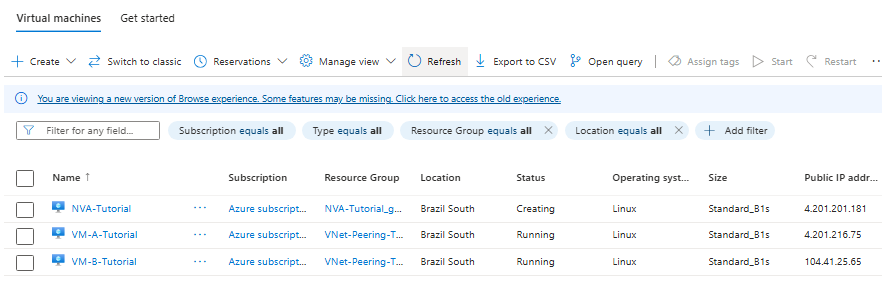

---

**Tutorial: Step-by-Step Guide to VNet Peering & Routing in Azure**

**Introduction**

Welcome! This tutorial will guide you through setting up VNet Peering between two Azure Virtual Networks, deploying test Virtual Machines, and optionally configuring User Defined Routes (UDRs) to direct traffic through a Network Virtual Appliance (NVA). By the end, you'll have a practical understanding of these core Azure networking concepts.

**Prerequisites**

- An active Azure Subscription (a free trial is sufficient).
- Access to the Azure Portal.

**Architecture Overview**

We will build the following:

- **VNet-A-Tutorial:** 10.0.0.0/16
    - **Subnet-A1-Tutorial:** 10.0.1.0/24 (for VM-A)
    - **(Optional) NVA-Subnet-Tutorial:** 10.0.2.0/24 (for NVA)
- **VNet-B-Tutorial:** 10.1.0.0/16
    - **Subnet-B1-Tutorial:** 10.1.1.0/24 (for VM-B)
- **VM-A-Tutorial:** Test VM in Subnet-A1-Tutorial.
- **VM-B-Tutorial:** Test VM in Subnet-B1-Tutorial.
- **(Optional) NVA-Tutorial:** A simple Linux VM acting as an NVA.
- **VNet Peering:** Connecting VNet-A-Tutorial and VNet-B-Tutorial.
- **(Optional) Route Table & UDR:** To route traffic from Subnet-B1-Tutorial through NVA-Tutorial.

---

**Section 1: Preparing Your Azure Environment**

**1.1. Sign in to the Azure Portal**

1. Open your web browser and navigate to [https://portal.azure.com](https://portal.azure.com).
2. Sign in with your Azure account credentials.  
   

**1.2. Create a Resource Group**
A resource group is a container that holds related resources for an Azure solution.

1. In the Azure portal search bar at the top, type "Resource groups" and select **Resource groups** from the services list.  
   
2. On the "Resource groups" page, click **+ Create**.
3. On the "Basics" tab for creating a resource group:
    - **Subscription:** Select your Azure subscription.
    - **Resource group:** Enter a name, e.g., VNet-Peering-Tutorial-RG.
    - **Region:** Select a region (e.g., "Brazil South"). Make sure to use this same region for all resources.  
      
4. Click **Review + create**.
5. After validation passes, click **Create**.

---

**Section 2: Creating Virtual Networks (VNets) and Subnets**

**2.1. Create VNet-A-Tutorial**

1. In the Azure portal search bar, type "Virtual networks" and select **Virtual networks**.  
   
2. On the "Virtual networks" page, click **+ Create**.
3. On the **Basics** tab:
    - **Resource group:** Select VNet-Peering-Tutorial-RG.
    - **Name:** Enter VNet-A-Tutorial.
    - **Region:** Same region (e.g., "Brazil South").  
      
4. Click the **IP Addresses** tab.
5. Under **IPv4 address space**, remove any default and enter 10.0.0.0/16.  
   
6. Under **Subnets**, click **+ Add subnet**.
7. In the "Add subnet" pane for Subnet-A1-Tutorial:
    - **Subnet name:** Subnet-A1-Tutorial.
    - **Subnet address range:** 10.0.1.0/24.  
      
      Click **Add**.
8. (Optional for NVA) Click **+ Add subnet** again for NVA-Subnet-Tutorial:
    - **Subnet name:** NVA-Subnet-Tutorial.
    - **Subnet address range:** 10.0.2.0/24.  
      
      Click **Add**.
9. Your IP Addresses tab should now list the subnets.  
   
10. Click **Review + create**.  
    
11. After validation passes, click **Create**.

**2.2. Create VNet-B-Tutorial**

1. Navigate back to "Virtual networks" and click **+ Create**.
2. **Basics** tab:
    - **Name:** VNet-B-Tutorial. (Ensure RG and Region are correct)
3. **IP Addresses** tab:
    - **IPv4 address space:** 10.1.0.0/16.  
      
4. **Subnets**: Click **+ Add subnet** for Subnet-B1-Tutorial:
    - **Subnet name:** Subnet-B1-Tutorial.
    - **Subnet address range:** 10.1.1.0/24.  Click **Add**.  
5. Click **Review + create**.  
    
    Then **Create**.

---

**Section 3: Deploying Test Virtual Machines (VMs)**

**3.1. Deploy VM-A-Tutorial in VNet-A-Tutorial**

1. Search for "Virtual machines" and select **Virtual machines**.  
   
2. Click **+ Create** and select **Azure virtual machine**.  
   
3. On the **Basics** tab:
    - **VM Name:** VM-A-Tutorial.
    - (Other fields: RG, Region, Image, Size, Auth, Ports as shown)  
      
4. Click the **Networking** tab.
5. Configure networking:
    - **Virtual network:** VNet-A-Tutorial.
    - **Subnet:** Subnet-A1-Tutorial (10.0.1.0/24).  
      
6. Click **Review + create**.  
   
7. After validation, click **Create**.

**3.2. Deploy VM-B-Tutorial**

1. Repeat VM creation steps.
2. **Basics** tab for VM-B-Tutorial.
3. **Networking** tab for VM-B-Tutorial:
    - **Virtual network:** VNet-B-Tutorial.
    - **Subnet:** Subnet-B1-Tutorial (10.1.1.0/24).
4. Click **Review + create**.  
   
   Then **Create**.

**3.3. (Important!) Note on Network Security Groups (NSGs) for ICMP (Ping)**

1. Go to VM-A-Tutorial -> **Networking**. Click **+ Create port rule** (or "Add inbound port rule").  
   
2. Configure rule for ICMP:
    - **Protocol:** ICMP, **Name:** Allow_ICMP_Inbound.  
      
3. Click **Add**. Repeat for VM-B-Tutorial.

---

**Section 4: Configuring VNet Peering**

**4.1. Create Peering from VNet-A-Tutorial to VNet-B-Tutorial**

1. Navigate to VNet-A-Tutorial -> **Peerings**. Click **+ Add**.
2. Configure peering:
    - **This VNet Peering link name:** VNet-A-to-VNet-B-Peering.
    - **Remote VNet Peering link name:** VNet-B-to-VNet-A-Peering.
    - **Remote virtual network:** VNet-B-Tutorial.
    - Ensure "Allow" options are checked as shown.  
      
3. Click **Add**.

**4.2. Verify Peering Status**

1. In VNet-A-Tutorial -> **Peerings**, check status is **Connected**.  
   
2. In VNet-B-Tutorial -> **Peerings**, check status is **Connected**.  
   

---

**Section 5: Testing Basic Connectivity**

**5.1. Get VM Private IP Addresses**

1. VM-A-Tutorial -> **Networking** (or Overview). Note its **Private IP address**.  
   
2. VM-B-Tutorial -> **Overview**. Note its **Private IP address**.  
   

**5.2. Connect to VMs and Test Ping**

1. Connect to VM-A-Tutorial (SSH/RDP).  
   
2. From VM-A-Tutorial, ping VM-B-Tutorial's private IP.  
   
3. Connect to VM-B-Tutorial.
4. From VM-B-Tutorial, ping VM-A-Tutorial's private IP.  
   

---

**Section 6: (Optional Advanced) Routing Traffic via a Network Virtual Appliance (NVA)**

**6.1. Deploy a Simple NVA (Linux VM)**

1. Deploy NVA-Tutorial in VNet-A-Tutorial and NVA-Subnet-Tutorial.
    - **Basics Tab:** same settings
    - **Networking Tab:**
        - **VNet:** VNet-A-Tutorial, **Subnet:** NVA-Subnet-Tutorial.  
          
    - **Review + Create Tab:**  
      
- Click **Create**. You can see it being created in the VM list.  
  
1. Go to NVA-Tutorial -> **Networking**. Click its Network Interface name.  
   
2. Network Interface -> **IP configurations**. Click ipconfig1.
3. Set **IP forwarding** to **Enabled**. Click **Save**.  
   
4. Note NVA-Tutorial's Private IP (e.g., 10.0.2.4).

**6.2. Create a Route Table**

1. Search for "Route tables" and select **Route tables**.  
   
2. Click **+ Create**.
3. **Basics** tab:
    - **Name:** RT-Force-To-NVA-Tutorial.  
      
4. Click **Review + create**.  
   
   Then **Create**.

**6.3. Add a User Defined Route (UDR)**

1. Navigate to RT-Force-To-NVA-Tutorial -> **Routes**. Click **+ Add**.
2. Configure route:
    - **Route name:** To-VNet-A-Via-NVA.
    - **Destination IP addresses/CIDR ranges:** 10.0.0.0/16.
    - **Next hop type:** Virtual appliance.
    - **Next hop address:** NVA-Tutorial's Private IP (e.g., 10.0.2.4).  
      
3. Click **Add**.

**6.4. Associate the Route Table with Subnet-B1-Tutorial**

1. In RT-Force-To-NVA-Tutorial -> **Subnets**. Click **+ Associate**.
2. Associate:
    - **Virtual network:** VNet-B-Tutorial.
    - **Subnet:** Check Subnet-B1-Tutorial.  
      
3. Click **OK**.

**6.5. Test Traffic Flow via NVA**

1. Connect to VM-B-Tutorial via SSH.
2. Use traceroute (Linux) or tracert (Windows) to trace the path to VM-A-Tutorial.
   
   You should see the Private IP address of NVA-Tutorial (e.g., 10.0.2.4) as one of the hops after VM-B's gateway, before reaching VM-A.
   (Note: The actual IP addresses and timings will vary. The key is seeing the NVA's IP in the path.)
3. You can also try pinging VM-A-Tutorial from VM-B-Tutorial. It should still work, but now traffic is flowing via the NVA.

---

**Section 7: Clean Up Resources**

To avoid ongoing charges, delete the resources you created. The easiest way is to delete the resource group.

1. In the Azure portal, navigate to **Resource groups**.
2. Select the VNet-Peering-Tutorial-RG resource group.
3. On the "Overview" page for the resource group, click **Delete resource group**.
4. Type the resource group name (VNet-Peering-Tutorial-RG) to confirm deletion.
5. Click **Delete**.

It might take a few minutes for all resources to be deleted.

---

**Conclusion**

Congratulations! You've successfully configured VNet Peering, deployed VMs, and optionally routed traffic through an NVA in Azure. This project covers fundamental Azure networking skills.

---
